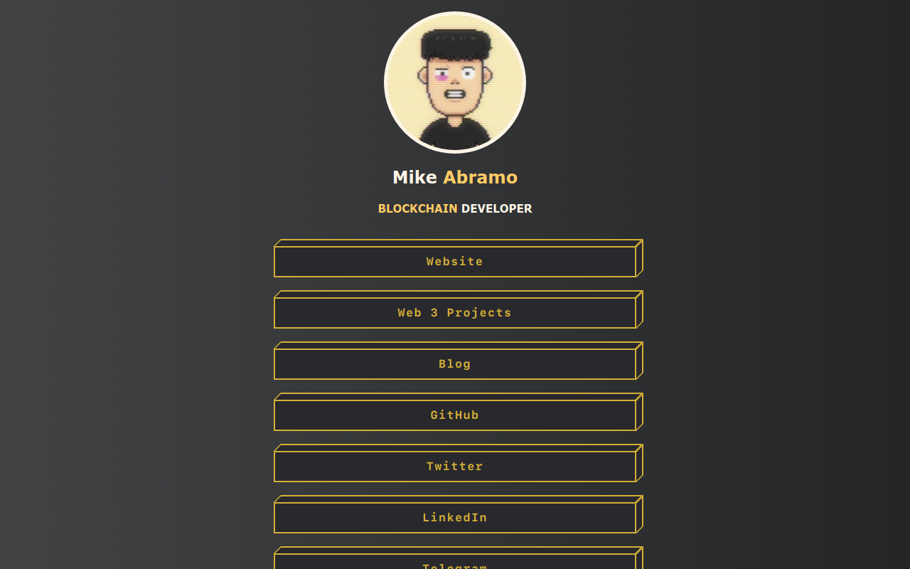

# :palm_tree:LinkTree Clone

**You can view a live demo** :point_right: [here](https://mabramo-linktree.vercel.app/).

## :dizzy: Features

- Responsive design that adapts to any screen size
- Customizable links, colors, and styles
- Social media icons
- Contact info display
- Colorful button animations

## :desktop_computer: Tech Stack

- HTML
- CSS
- JavaScript Feather Icons
- Vercel

## :rocket:Getting Started

1. Clone the repository.

2. Open `index.html` in your browser.

3. Customize links, colors, and styles as needed.

4. Add your profile image and info.
5. Swap out the links in `index.html` with the links to your socials.

6. Deploy to GitHub Pages or host elsewhere.

## :building_construction: Future Improvements

- Add dark mode support.
- Allow importing links from external data source.
- Add animations and transitions.
- Package as a reusable component.
